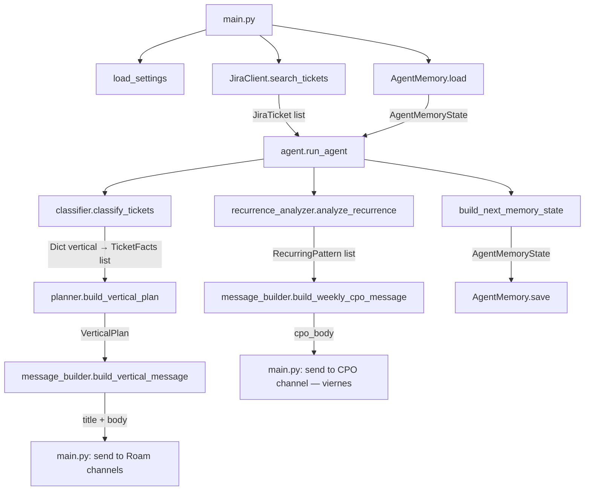

# Flujo de Datos del Agente

Describe el recorrido completo desde la ejecución hasta el envío del mensaje a Roam.

## Diagrama de flujo

## Paso a paso

### 1. Inicialización (`main.py`)
- `load_settings()` lee todas las env vars en un `Settings` frozen dataclass.
- `AgentMemory.load()` carga el estado previo desde `data/agent_state.json` (o retorna estado vacío si no existe).
- Se instancian `JiraClient` y `RoamClient`.

### 2. Fetch de tickets (`jira_client.py`)
- `search_tickets(jql, max_results)` llama a `POST /rest/api/3/search/jql` con paginación.
- El JQL por defecto trae tickets abiertos + los cerrados actualizados hoy.
- Opcionalmente, `search_finalized_tickets()` trae tickets cerrados en los últimos N días (para análisis de recurrencia).
- Retorna una lista de `JiraTicket` (dataclasses inmutables).

### 3. Clasificación (`classifier.py`)
- `classify_tickets()` convierte cada `JiraTicket` en un `TicketFacts` con flags computados:
  - `created_today`, `finalized_today`, `is_stale`
  - `created_since_last_message`, `finalized_since_last_message` — comparando contra `last_message_sent_at`
  - `status_changed`, `assignee_changed` — comparando contra `last_sent_tickets` (estado al momento del último mensaje enviado)
  - `vertical` — resuelto desde labels del ticket (ver [glossary](../business/glossary.md))
- Retorna un `Dict[str, List[TicketFacts]]` agrupado por vertical.

### 4. Planificación (`planner.py`)
- `build_vertical_plan(vertical, tickets)` evalúa los flags y genera `AgentAction` items:
  - `notify_changes` si hay tickets con `status_changed`, `created_since_last_message` o `finalized_since_last_message`
  - `notify_unchanged_recent` para tickets activos sin cambio de estado en menos de 5 días
  - `notify_unchanged_stale` para tickets activos sin cambio de estado en 5 días o más
- Retorna un `VerticalPlan`. Si no hay acciones, el vertical se omite del output.

### 5. Construcción de mensajes (`message_builder.py`)
- `build_vertical_message()` renderiza el mensaje diario por vertical: cambios desde el último mensaje, sin movimiento reciente y estancados.
- `build_weekly_cpo_message()` renderiza el reporte semanal del CPO con métricas de avance de la semana (buffer acumulado) y patrones recurrentes. Solo se invoca los viernes.

### 6. Análisis de recurrencia (`recurrence_analyzer.py`) — opcional
- Se ejecuta solo si `LLM_WEBHOOK_URL` está configurado.
- Llama al LLM con los tickets activos + finalizados.
- Retorna `List[RecurringPattern]` (grupos de tickets con el mismo tipo de problema).

### 7. Envío a Roam (`main.py` + `roam_client.py`)
- **`--notify-only`** (diario, 17:00): envía mensajes a los canales de verticales. Los viernes también envía el reporte CPO semanal.
- **`--roadmap-only`** (cada 30 min): acumula el buffer semanal y ejecuta el roadmap agent, sin enviar mensajes a canales.
- Prioridad de canal: `channel_id` (API Bearer) > webhook URL (fallback).
- En `--dry-run`: se imprime en stdout y se guarda HTML en `reports/`, no se envía ni persiste memoria.

### 8. Persistencia de memoria (`memory.py`)
- `AgentMemory.save(next_memory)` serializa el estado nuevo a JSON.
- La memoria guarda por ticket: `status`, `assignee`, `updated`, `last_status_change_at`.
- `last_sent_tickets` captura ese estado en el momento en que se envió el último mensaje, permitiendo detectar cambios reales desde el último reporte.
- `weekly_buffer` acumula snapshots diarios de lunes a viernes para el reporte CPO. Se resetea al enviar el reporte (solo en `--notify-only`).
