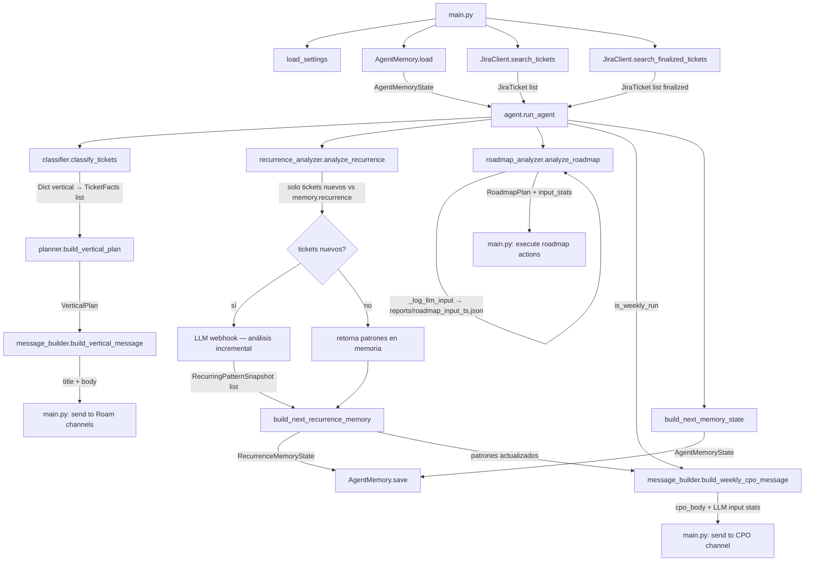

# Flujo de Datos del Agente

Describe el recorrido completo desde la ejecución hasta el envío del mensaje a Roam.

## Diagrama de flujo

## Paso a paso

### 1. Inicialización (`main.py`)
- `load_settings()` lee todas las env vars en un `Settings` frozen dataclass.
- `AgentMemory.load()` carga el estado previo desde `data/agent_state.json` (o retorna estado vacío si no existe).
- Se instancian `JiraClient` y `RoamClient`.

### 2. Fetch de tickets (`jira_client.py`)
- `search_tickets(jql, max_results)` llama a `POST /rest/api/3/search/jql` con paginación y `expand: changelog`.
- `search_finalized_tickets()` trae tickets cerrados en los últimos N días (para análisis de recurrencia).
- Retorna listas de `JiraTicket` (dataclasses inmutables).

### 3. Clasificación (`classifier.py`)
- `classify_tickets()` convierte cada `JiraTicket` en un `TicketFacts` con flags computados:
  - `created_today`, `finalized_today`, `is_stale`
  - `created_since_last_message`, `finalized_since_last_message` — comparando contra `last_message_sent_at`
  - `status_changed`, `assignee_changed` — comparando contra `last_sent_tickets` (estado al momento del último mensaje enviado)
  - `vertical` — resuelto desde labels del ticket (ver [glossary](../business/glossary.md))
- Retorna un `Dict[str, List[TicketFacts]]` agrupado por vertical.

### 4. Planificación (`planner.py`)
- `build_vertical_plan(vertical, tickets)` evalúa los flags y genera `AgentAction` items:
  - `notify_changes` si hay tickets con `status_changed`, `created_since_last_message` o `finalized_since_last_message`
  - `notify_unchanged_recent` para tickets activos sin cambio de estado en menos de 5 días
  - `notify_unchanged_stale` para tickets activos sin cambio de estado en 5 días o más
- Retorna un `VerticalPlan`. Si no hay acciones, el vertical se omite del output.

### 5. Construcción de mensajes (`message_builder.py`)
- `build_vertical_message()` renderiza el mensaje diario por vertical: cambios desde el último mensaje, sin movimiento reciente y estancados.
- `build_weekly_cpo_message()` renderiza el reporte semanal del CPO. Se invoca solo en corridas con `is_weekly_run=True` (viernes o `--weekly`).
  - Las métricas se derivan directamente de los tickets activos y finalizados usando `created` y `last_status_change_at`.
  - `week_start` = lunes de la semana del viernes más reciente; `week_end` = ese viernes.
  - Al final del mensaje se appendean los stats del input al LLM del roadmap agent (chars, tokens estimados, path al log).

### 6. Análisis de recurrencia (`recurrence_analyzer.py`) — opcional
- Se ejecuta si `LLM_WEBHOOK_URL` está configurado.
- **Incremental**: compara todos los tickets contra `memory.recurrence.analyzed_ticket_keys`. Solo envía al LLM los tickets nuevos, junto con los patrones ya detectados como contexto.
- Si no hay tickets nuevos, retorna los patrones en memoria sin llamar al LLM.
- Cada corrida loguea el payload completo en `reports/recurrence_input_<timestamp>.json` con stats de chars, tokens estimados y conteo de tickets nuevos vs total.
- Retorna `List[RecurringPatternSnapshot]`. `build_next_recurrence_memory()` construye el nuevo estado para persistir.

### 7. Análisis de roadmap (`roadmap_analyzer.py`) — opcional, solo corridas semanales o `--force-roadmap`
- Recibe tickets activos, finalizados, patrones de recurrencia e ideas actuales del roadmap.
- Llama al LLM con todo el contexto y retorna un `RoadmapPlan` con acciones (vote, comment, create_idea, reply_comment).
- Loguea el payload en `reports/roadmap_input_<timestamp>.json`. Los stats se incluyen en el `RoadmapPlan.input_stats` y se appendean al mensaje CPO.

### 8. Envío a Roam (`main.py` + `roam_client.py`)
- **`--notify-only`** (diario, 17:00): envía mensajes a los canales de verticales. Los viernes también envía el reporte CPO semanal.
- **`--roadmap-only`** (cada 30 min): ejecuta el roadmap agent sin enviar mensajes a canales.
- **`--weekly`**: fuerza corrida semanal independientemente del día.
- Prioridad de canal: `channel_id` (API Bearer) > webhook URL (fallback).
- En `--dry-run`: se imprime en stdout y se guarda HTML en `reports/`, no se envía ni persiste memoria.

### 9. Persistencia de memoria (`memory.py`)
- `AgentMemory.save(next_memory)` serializa el estado nuevo a JSON.
- Campos persistidos por ticket: `status`, `assignee`, `updated`, `last_status_change_at`.
- `last_sent_tickets`: estado de tickets al momento del último mensaje enviado — permite detectar cambios reales desde el último reporte.
- `roadmap`: IDs de ideas votadas, comentadas, con reply y creadas por el agente.
- `recurrence`: patrones detectados (`RecurringPatternSnapshot[]`), keys de tickets ya analizados y fecha del último análisis. Permite análisis incremental: solo se re-analiza lo nuevo.
