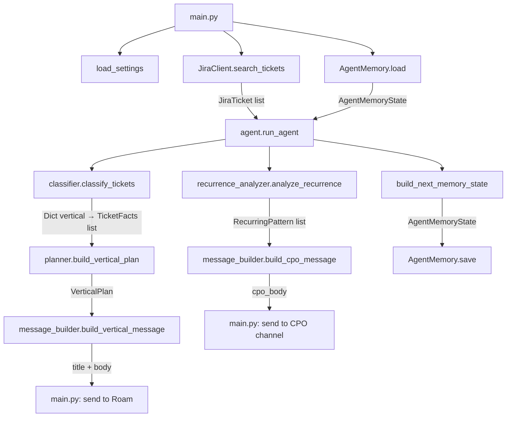

# Flujo de Datos del Agente

Describe el recorrido completo desde la ejecución hasta el envío del mensaje a Roam.

## Diagrama de flujo

## Paso a paso

### 1. Inicialización (`main.py`)
- `load_settings()` lee todas las env vars en un `Settings` frozen dataclass.
- `AgentMemory.load()` carga el estado previo desde `data/agent_state.json` (o retorna estado vacío si no existe).
- Se instancian `JiraClient` y `RoamClient`.

### 2. Fetch de tickets (`jira_client.py`)
- `search_tickets(jql, max_results)` llama a `POST /rest/api/3/search/jql` con paginación.
- El JQL por defecto trae tickets abiertos + los cerrados actualizados hoy.
- Opcionalmente, `search_finalized_tickets()` trae tickets cerrados en los últimos N días (para análisis de recurrencia).
- Retorna una lista de `JiraTicket` (dataclasses inmutables).

### 3. Clasificación (`classifier.py`)
- `classify_tickets()` convierte cada `JiraTicket` en un `TicketFacts` con flags computados:
  - `created_today`, `finalized_today`, `is_stale`, `status_changed_today`
  - `changed_since_last_run`, `status_changed`, `assignee_changed` (comparando con memoria)
  - `vertical` — resuelto desde labels del ticket (ver [glossary](../business/glossary.md))
- Retorna un `Dict[str, List[TicketFacts]]` agrupado por vertical.

### 4. Planificación (`planner.py`)
- `build_vertical_plan(vertical, tickets)` evalúa los flags y genera `AgentAction` items:
  - `notify_created_today` si hay tickets con `created_today=True`
  - `notify_finished_today` si hay tickets con `finalized_today=True`
  - `notify_stale_tickets` si hay tickets con `is_stale=True`
- Retorna un `VerticalPlan`. Si no hay acciones, el vertical se omite del output.

### 5. Construcción de mensajes (`message_builder.py`)
- `build_vertical_message()` renderiza el mensaje por vertical en Markdown.
- `build_cpo_message()` renderiza el análisis ejecutivo con métricas globales y patrones recurrentes.

### 6. Análisis de recurrencia (`recurrence_analyzer.py`) — opcional
- Se ejecuta solo si `ANTHROPIC_API_KEY` está configurado.
- Llama a `claude-sonnet-4-6` con los tickets activos + finalizados.
- Retorna `List[RecurringPattern]` (grupos de tickets con el mismo tipo de problema).

### 7. Envío a Roam (`main.py` + `roam_client.py`)
- Por cada vertical con plan de acciones, se envía el mensaje a Roam.
- Prioridad de canal: `channel_id` (API Bearer) > webhook URL (fallback).
- Si hay `ROAM_CPO_CHANNEL_ID`, se envía el análisis CPO por separado.
- En `--dry-run`: se imprime en stdout, no se envía ni persiste memoria.

### 8. Persistencia de memoria (`memory.py`)
- `AgentMemory.save(next_memory)` serializa el estado nuevo a JSON.
- La memoria guarda por cada ticket: `status`, `assignee`, `updated`, `last_status_change_at`.
- Esto permite detectar cambios en la siguiente corrida.
