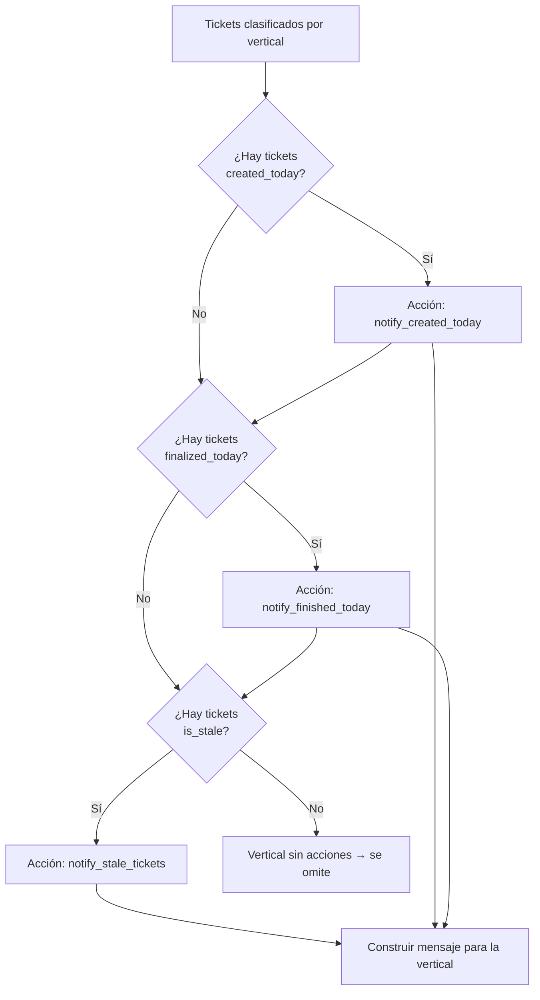

# Decisiones del Agente

Describe las reglas de negocio que determinan qué comunica el agente en cada corrida.

## Flujo de decisión por vertical

## Reglas por tipo de acción

### `notify_created_today`
- **Condición**: `ticket.created_today == True`
- **Contenido del mensaje**: key del ticket (con link), summary, estado actual, informador.
- **Indicador visual**: emoji 🆕 en el encabezado de sección.

### `notify_finished_today`
- **Condición**: `ticket.finalized_today == True` (status_category == "Done" Y cambió hoy)
- **Contenido**: key, summary, estado, informador.
- **Al final de la sección**: mención a los reporters únicos con `@reporter: sus tickets fueron cerrados hoy ✅`
- **Indicador visual**: emoji ✅ en el encabezado de sección.

### `notify_stale_tickets`
- **Condición**: `ticket.is_stale == True` (sin cambio de estado en los últimos `STALE_TICKET_DAYS` días)
- **Contenido**: key, summary, estado, informador. Tickets con criticidad "Highest" se marcan con 🚨.
- **Al final de la sección**: mención a todos los reporters únicos preguntando si el ticket sigue siendo necesario.
- **Indicador visual**: emoji 🔴 en el encabezado de sección.

## Reglas del mensaje

- **Encabezado**: muestra cuántos tickets de cada tipo hay para la vertical + nombre de proyecto.
- **Resumen de cambios**: si algún ticket cambió de estado desde la última corrida, se lista primero.
- **Límite de tickets**: `MAX_ITEMS_PER_VERTICAL` (default 20). Si hay más, se indica cuántos adicionales hay.
- **Tickets con criticidad "Highest"**: siempre se marcan con 🚨.
- **Si no hay acciones** para una vertical: el vertical no genera ningún mensaje (se omite).

## Canal CPO (análisis ejecutivo)

Además de los mensajes por vertical, el agente envía un análisis ejecutivo al canal CPO si `ROAM_CPO_CHANNEL_ID` está configurado.

Contenido del mensaje CPO:
- Métricas globales: total activos, estancados, críticos, creados hoy, finalizados hoy.
- Desglose por vertical.
- Top 8 tickets más estancados (ordenados por días sin movimiento).
- Patrones recurrentes (si `ANTHROPIC_API_KEY` está configurado): grupos de tickets que representan el mismo problema.
- Distribución por estado de todos los tickets activos.
- Señales para el roadmap: vertical con mayor carga, tickets con criticidad Highest, tickets muy estancados.

## Comportamiento en `--dry-run`

- Se imprime en stdout el plan y el mensaje por cada vertical.
- Se imprime el cuerpo del análisis CPO si aplica.
- **No se envía nada a Roam**.
- **No se persiste la memoria**: la próxima corrida real compara contra el estado anterior a la dry-run.
